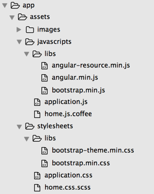
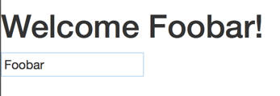

# AngularJS快速入门

##为什么使用AngularJS

- 扩展HTML
> Angular使用directive(指令)扩展HTML标签原声属性，使用这些directive可以帮助我们节省一些重复性代码，把注意力放在业务逻辑开发上

- Scope
> Scope内的变量生命周期只在当前scope中，不会污染全局变量

- 使用灵活
> 通过定义ng-app来确定某块使用angular,可以不必全部使用。当引入angular后，即可使用angular提供的directive,filter,module等功能

##安装

访问官方网址http://angularjs.org,下载最新的Stable + Minified版本，或者使用CDN,或者使用bower安装。

如果结合Server Side(服务端)，则需要下载angular-resource.js(点击下载页面上的"Extra",进入页面并下载)

这里服务端使用的是Ruby on Rails,代码结构如下

	public
	  - javascripts
	      - angular.min.js
	  - index.html
	  
首先看index.html内容

	<!DOCTYPE html>
	<html ng-app>
	  <head>
		<meta charset="utf-8" />
		<title>Demo</title>
		
	  </head>
	  <body>
		<h1>Welcome {{name}}!</h1>
		<input type="text" placeholder="请输入你的姓名" ng-model="name" />
	  </body>
	</html>

ng-app表明html DOM接下来由angular接管。{{name}}是angular的自省表达式。ng-model是angular的一种directive, 这里会反射h1种的name,做到动态绑定。

##初始化项目

这里使用CSS框架Bootstrap, 下载bootstrap-min.css, bootstrap-theme-min.css, 和bootstrap.min.js。将这些第三方库以及框架放入libs目录下，形成的目录如下

启动Rails程序后查看源码，应该如下:

	<!DOCTYPE html>
	<html ng-app>
	<head>
  	  <title>Flights</title>
      <link data-turbolinks-track="true" href="/assets/libs/bootstrap.min.css?body=1" media="all" rel="stylesheet" />
      <link data-turbolinks-track="true" href="/assets/libs/bootstrap-theme.min.css?body=1" media="all" rel="stylesheet" />       
      <link data-turbolinks-track="true" href="/assets/application.css?body=1" media="all" rel="stylesheet" />
      
      
      
      
	  
      
      
      <meta content="authenticity_token" name="csrf-param" />
      <meta content="MV9htXR6EbPMIF9bIdAZ3T0ckEyWXR3jmfQapiNSK3s=" name="csrf-token" />
    </head>
    <body>
      <h1>Welcome {{name}}!</h1>
      <input type="text" placeholder="请输入你的姓名" ng-model="name" />
    </body>
    </html>
    
在输入框中输入Foobar,Welcome Foobar!将会立刻显示

##Scope数据

Angular管辖的每一个Element都有它们自己的scope, 一旦element绑定到一个controller,那么这个controller的$scope对象将会注入到这个element中,在element上下文中可以访问$scope中的数据。